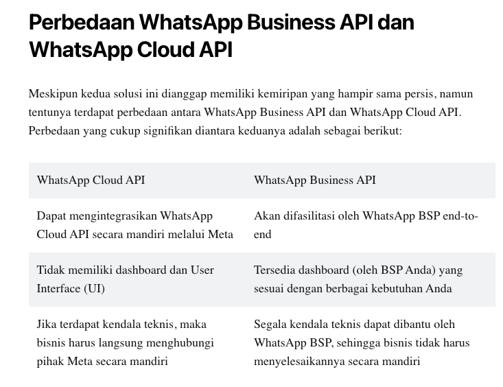

# Whatsapp Cloud API Wrapper for Golang

v14.0 Whatsapp Cloud API Wrapper for Golang

Made this cause I haven't found any reliable whatsapp cloud api wrapper for golang

## Installation

```
go get github.com/febriliankr/whatsapp-cloud-api
```

or if you want to use specific version
    
    ```
    go get github.com/febriliankr/whatsapp-cloud-api@v1.0.1
    ```

## Getting the Whatsapp Cloud API Access

Official documentation: https://developers.facebook.com/docs/whatsapp/cloud-api/get-started

Go to your facebook developer console to get the token https://developers.facebook.com/apps/2017523718408931/whatsapp-business/wa-dev-console

## FAQ

- Q: How do I signup to get the token?
- A: Here https://developers.facebook.com. Registration guide here: https://developers.facebook.com/docs/development/register/

- Q: Whats the difference between Qiscus and other provider's Whatsapp API to this Cloud API?
- A: This Cloud API is provided directly by Meta, no need to use 3rd party provider.
   More: https://www.qiscus.com/id/blog/meta-luncurkan-whatsap-cloud-api-untuk-publik/



## Usage

```
// Initialize Whatsapp
wa := whatsapp.NewWhatsapp(token, myPhoneId)

// Send whatsapp text without parameters
request := wa.CreateSendTemplateRequest("RECEIVER_PHONE_NUMBER", "your_template_name", whatsapp.Indonesian, nil)
res, err := wa.SendWithTemplate(request)

// Send whatsapp text with parameters
parameters := wa.GenerateTemplateParameters("text", "48884")
components := wa.TemplateComponent("body", parameters)
request := wa.CreateSendTemplateRequest("RECEIVER_PHONE_NUMBER", "your_template_name", whatsapp.Indonesian, components)
res, err := wa.SendWithTemplate(request)
```

Check more usage example in example/example.go

## Tutorial for Myself!

Releasing new version
```
$ git commit -m "hello: changes for v1.0.0"
$ git tag v1.0.0
$ git push origin v1.0.0
```